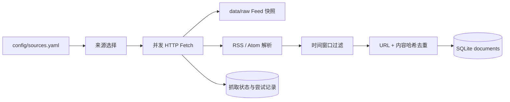

# 确定性信息采集

Task 3 提供不依赖模型的 RSS/Atom 采集层。它负责把公开来源转换成可追溯、可去重的本地
原文记录；事件归并、重要性判断和 24 小时/7 天分析属于后续阶段。

## 默认来源

来源注册表位于 `config/sources.yaml`，当前包含 10 个 Feed：

- Ethereum Foundation Blog、go-ethereum Releases；
- Flashbots Collective、Uniswap Governance、Aave Governance；
- OpenAI Agents SDK Releases；
- Federal Reserve、European Central Bank、U.S. SEC；
- Global Disaster Alert and Coordination System。

每个来源明确标注主题和 Tier。治理论坛属于 Tier 3，只能触发进一步调查，不能单独支持
`confirmed`；官方公告、软件发布和权威机构 Feed 为 Tier 1。新增来源时必须给出唯一 ID、
主页、Feed URL、Tier 和至少一个主题。

这只是可运行的首批来源，不代表最终覆盖已经完整。宏观数据日历、链上数据、论文、法院文件、
新闻媒体和需要认证的 API 将作为后续 adapter 加入。

## 采集流程



默认行为：

- 最多并发抓取 4 个来源；
- 单个来源超时 15 秒，最多读取 5 MiB；
- 只导入最近 8 天内容，每个 Feed 最多处理 50 条；
- 对网络错误、HTTP 429 和 5xx 进行一次短暂重试；
- 使用 ETag 与 Last-Modified 发起条件请求，304 不重复解析；
- 一个来源失败时其他来源继续，整轮状态记为 `partial`；
- 每个成功响应原样保存在 `data/raw/YYYY-MM-DD/<source-id>/`；
- HTML 只作为不可信内容转成纯文本，不执行脚本或 Feed 内指令。

Task 3 保存的是 Feed 提供的正文或摘要，并非所有网页的完整正文。后续若增加网页正文提取，必须
继续保留原始 URL、抓取时间和当前 Feed 快照。

## 使用命令

查看来源和最近状态：

```bash
pnpm sources
```

联网验证但不写数据库或原始文件：

```bash
pnpm collect:dry -- --source ethereum-foundation-blog
```

采集单个或多个来源：

```bash
pnpm collect -- --source ethereum-foundation-blog
pnpm collect -- --source federal-reserve-press --source ecb-press
```

采集全部启用来源：

```bash
pnpm collect
```

可使用 `--config`、`--path` 和 `--data-dir` 指定其他配置、数据库及原始数据目录。相对路径
统一相对于项目根目录解析。

命令退出码：

- `0`：所有来源成功或返回 304；
- `2`：部分或全部来源失败，但失败详情已经记录；
- `1`：配置无效、来源 ID 不存在或初始化错误。

## 持久状态

- `collection_runs`：整轮采集的来源数、成功/失败数、新增与重复文档数；
- `collection_attempts`：每个来源的 HTTP 状态、原始快照、条目数和错误；
- `source_fetch_state`：ETag、Last-Modified、最近成功时间和连续失败次数；
- `documents`：规范化标题、正文/摘要、发布时间、抓取时间、内容哈希和来源主题。

## Codex 网页发现

固定 RSS/Atom 采集之外，系统支持一次本地 Codex 网页发现：

1. `gpt-6-astra` low reasoning 读取 `config/discovery.yaml`；
2. 严格搜索晨报截止时间之前 24 小时的关注关键词；
3. 按 `prompts/discovery-daily.md` 生成可追溯 JSON；
4. 使用 `pnpm discovery:import -- --input <file>` 写入与 RSS 文档相同的候选管线。

网页发现项目必须包含直接原文 URL、发布时间、检索时间、topic 和来源等级；
搜索摘要、发布时间未知页面和窗口外内容不能导入。该任务不使用 OpenAI API Key，
但消耗用户的 Codex/ChatGPT 使用额度。

当前推荐调度为每天 06:00 执行网页发现、06:30 执行 RSS 采集与日报分析。
