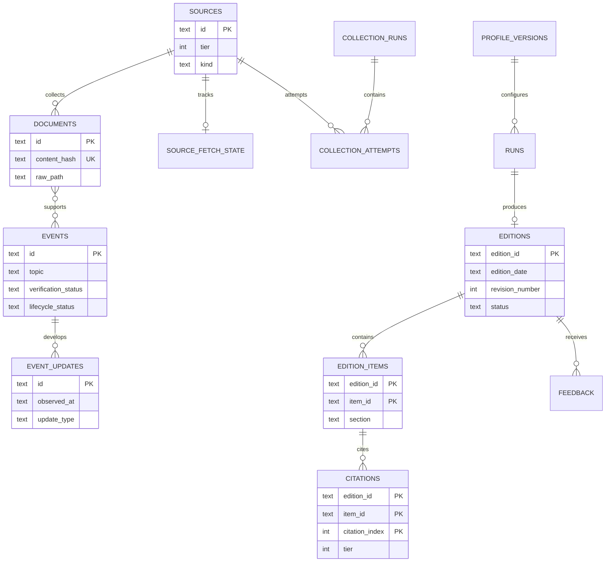

# 数据模型与本地存储

Task 2 使用 Node.js 内置 SQLite，默认数据库位于
`data/morning-signal.db`。它不需要单独安装数据库服务，也不会把数据发送到外部。

## 数据链路



## 表的职责

- `sources`：来源目录、质量层级和采集方式。
- `source_fetch_state`：条件请求缓存、最近成功时间和连续失败次数。
- `collection_runs` 与 `collection_attempts`：整轮和来源级采集结果。
- `documents`：抓取后的原文快照。URL 与内容哈希用于去重，`raw_path` 可指向
  `data/raw/` 中的原始响应文件。
- `events`：跨来源归并后的新闻事件，是 24 小时摘要与 7 天补漏的共同实体。
- `event_documents`：事件与证据原文的多对多关系，并区分支持、反驳和背景材料。
- `event_updates`：同一事件随时间获得确认、修正或解决的演进记录。
- `analysis_bundles`：按日期保存的不可变候选输入包，供 Codex 分析和人工追溯。
- `profile_versions`：每次运行所用关注配置的不可歧义快照。
- `runs`：一次 Worker 执行的阶段、状态、错误与指标。
- `editions`：完整日报 JSON，同时保存日期、状态和修订号供快速索引。
- `edition_items` 与 `citations`：将日报拆成可搜索条目，并保留每条结论的引用。
- `feedback`：人工审核和长期个性化反馈。

## 核心约束

1. `documents.content_hash` 与 URL 唯一，重复采集不会生成重复原文。
2. 一条事件可以关联多个原文；原文也可以为多个事件提供背景。
3. 每个日期可以有多个可见修订，`getEditionByDate` 默认返回最高修订号。
4. 状态为 `published` 或 `revised` 的日报由 SQLite trigger 锁定，禁止更新或删除。
   修正只能用新的 `edition_id` 和更高的 `revision_number` 新增一版。
5. 日报写入前必须通过共享 Zod 契约，读取时再次校验，避免损坏数据进入 Dashboard。
6. `documents`、`events`、`edition_items` 使用 FTS5 全文索引。用户查询会先转义，不能注入
   FTS 运算符。
7. 外键约束始终开启；文件型数据库使用 WAL 模式，以便未来 Worker 写入时 Dashboard
   仍能读取。

## 命令

```bash
pnpm db:init
pnpm db:status
```

也可以直接指定一个隔离数据库：

```bash
pnpm --filter @morning-signal/worker exec tsx src/cli.ts db init \
  --path /absolute/path/to/morning-signal.db
```

迁移是幂等的。每次打开数据库都会检查 `schema_migrations` 并只执行尚未应用的版本。

## 本地文件边界

- 数据库及 WAL 辅助文件被 `.gitignore` 排除。
- 默认只保存在本机 `data/`，Task 2 不包含 AWS 上传或网站发布。
- 备份时应同时停止写入，或使用 SQLite backup API；不要只在运行中复制主 `.db` 文件而忽略
  `-wal`。
